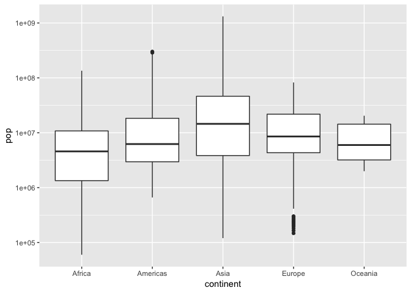

hw02\_gapminder
================
Liming Liu
2018-09-20

# Explore Gapminder and use dplyr

## Bring rectangular data in

``` r
library(tidyverse)
```

    ## ── Attaching packages ────────────────────────────────────────────────────────────────────────────── tidyverse 1.2.1 ──

    ## ✔ ggplot2 3.0.0     ✔ purrr   0.2.5
    ## ✔ tibble  1.4.2     ✔ dplyr   0.7.6
    ## ✔ tidyr   0.8.1     ✔ stringr 1.3.1
    ## ✔ readr   1.1.1     ✔ forcats 0.3.0

    ## ── Conflicts ───────────────────────────────────────────────────────────────────────────────── tidyverse_conflicts() ──
    ## ✖ dplyr::filter() masks stats::filter()
    ## ✖ dplyr::lag()    masks stats::lag()

``` r
library(gapminder)
```

## Smell test the data

#### 1.The type of gapminder

``` r
typeof(gapminder)
```

    ## [1] "list"

#### 2\. The class of gapminder

``` r
class(gapminder)
```

    ## [1] "tbl_df"     "tbl"        "data.frame"

#### 3\. How many rows and columns?

1704 rows,6
columns

``` r
nrow(gapminder)
```

    ## [1] 1704

``` r
ncol(gapminder)
```

    ## [1] 6

#### 4\. Can you get these facts about “extent” or “size” in more than one way? Can you imagine different functions being useful in different contexts?

1.  Use array()

<!-- end list -->

``` r
array(gapminder)
```

    ## # A tibble: 1,704 x 6
    ##    <fct>       <fct> <int> <dbl>    <int> <dbl>
    ##  1 Afghanistan Asia   1952  28.8  8425333  779.
    ##  2 Afghanistan Asia   1957  30.3  9240934  821.
    ##  3 Afghanistan Asia   1962  32.0 10267083  853.
    ##  4 Afghanistan Asia   1967  34.0 11537966  836.
    ##  5 Afghanistan Asia   1972  36.1 13079460  740.
    ##  6 Afghanistan Asia   1977  38.4 14880372  786.
    ##  7 Afghanistan Asia   1982  39.9 12881816  978.
    ##  8 Afghanistan Asia   1987  40.8 13867957  852.
    ##  9 Afghanistan Asia   1992  41.7 16317921  649.
    ## 10 Afghanistan Asia   1997  41.8 22227415  635.
    ## # ... with 1,694 more rows

2.  Use dim()

<!-- end list -->

``` r
dim(gapminder)
```

    ## [1] 1704    6

3.  Use dim\_desc()

<!-- end list -->

``` r
dim_desc(gapminder)
```

    ## [1] "[1,704 x 6]"

4.  Use dim.data.frame()

<!-- end list -->

``` r
dim.data.frame(gapminder)
```

    ## [1] 1704    6

#### 5\. What data type is each variable?

``` r
head(gapminder)
```

    ## # A tibble: 6 x 6
    ##   country     continent  year lifeExp      pop gdpPercap
    ##   <fct>       <fct>     <int>   <dbl>    <int>     <dbl>
    ## 1 Afghanistan Asia       1952    28.8  8425333      779.
    ## 2 Afghanistan Asia       1957    30.3  9240934      821.
    ## 3 Afghanistan Asia       1962    32.0 10267083      853.
    ## 4 Afghanistan Asia       1967    34.0 11537966      836.
    ## 5 Afghanistan Asia       1972    36.1 13079460      740.
    ## 6 Afghanistan Asia       1977    38.4 14880372      786.

From the results above, we can see that column “country”, “continent”
are factor; column “year”, “pop” are integer; column “lifeExp”,
“gdpPercap” are double

## Explore individual variables

Pick at least one categorical variable and at least one quantitative
variable to explore.

select variables in “continent” and “pop”
columns

``` r
test_var <- select(gapminder, continent, pop)
```

#### 1\. What are possible values (or range, whichever is appropriate) of each variable?

``` r
summary(test_var)
```

    ##     continent        pop           
    ##  Africa  :624   Min.   :6.001e+04  
    ##  Americas:300   1st Qu.:2.794e+06  
    ##  Asia    :396   Median :7.024e+06  
    ##  Europe  :360   Mean   :2.960e+07  
    ##  Oceania : 24   3rd Qu.:1.959e+07  
    ##                 Max.   :1.319e+09

So we can see that there are 6 kinds of factors in “continent”,which
include “Africa”, “Americas”, “Asia”, “Europe”, and “Oceania” For the
quantitative variables in “pop”, the minimum is 6.001e+04, and the
maximum is
1.319e+09.

#### 2\. What values are typical? What’s the spread? What’s the distribution? Etc., tailored to the variable at hand.

In the “pop” data

the mean is:

``` r
mean(test_var$pop)
```

    ## [1] 29601212

the range is:

``` r
range(test_var$pop)
```

    ## [1]      60011 1318683096

The quantile is:

``` r
quantile(test_var$pop)
```

    ##         0%        25%        50%        75%       100% 
    ##      60011    2793664    7023596   19585222 1318683096

Check the spread for each continent

``` r
Af <- filter(test_var, continent == "Africa")
Am <- filter(test_var, continent == "Americas")
As <- filter(test_var, continent == "Asia")
Eu <- filter(test_var, continent == "Europe")
Oc <- filter(test_var, continent =="Oceania")
```

range in Africa

``` r
range(Af$pop)
```

    ## [1]     60011 135031164

range in Americas

``` r
range(Am$pop)
```

    ## [1]    662850 301139947

range in Asia

``` r
range(As$pop)
```

    ## [1]     120447 1318683096

range in Europe

``` r
range(Eu$pop)
```

    ## [1]   147962 82400996

range in Oceania

``` r
range(Oc$pop)
```

    ## [1]  1994794 20434176

The distribution for all the data in
    pop

``` r
ggplot(test_var, aes(pop)) + geom_histogram()
```

    ## `stat_bin()` using `bins = 30`. Pick better value with `binwidth`.

<!-- -->

distribution in Africa

``` r
ggplot(Af, aes(pop)) + geom_histogram(bins = 30)
```

<!-- -->

distribution in Americas

``` r
ggplot(Am, aes(pop)) + geom_histogram(bins = 30)
```

<!-- -->

distribution in Asia

``` r
ggplot(As, aes(pop)) + geom_histogram(bins = 30)
```

<!-- -->

distribution in Europe

``` r
ggplot(Eu, aes(pop)) + geom_histogram(bins = 30)
```

<!-- -->

distribution in Oceania

``` r
ggplot(Oc, aes(pop)) + geom_histogram(bins = 30)
```

<!-- -->

## Explore various plot types

Make a few plots, probably of the same variable you chose to
characterize numerically. You can use the plot types we went over in
class (cm006) to get an idea of what you’d like to make. Try to explore
more than one plot type.

#### 1\. A scatterplot of two quantitative variables

the scatter plot of year and
pop

``` r
ggplot(gapminder, aes(year, pop)) + scale_y_log10() + geom_point(alpha=0.1)
```

<!-- -->

#### 2\. A plot of one quantitative variable

the density plot of lifeExp

``` r
ggplot(gapminder, aes(lifeExp)) + geom_density(fill="pink")
```

<!-- -->

#### 3\. A plot of one quantitative variable and one categorical

box plot for each continent

``` r
ggplot(test_var, aes(continent, pop)) + scale_y_log10() + geom_boxplot()
```

<!-- -->

## Use filter(), select() and %\>%

After 1980, the lifeExp in each continent, and build a scatter plot

``` r
gapminder %>% 
  select(continent,lifeExp, year) %>% 
  filter(year > 1980) %>% 
  ggplot(aes(continent, lifeExp)) + geom_point(alpha=0.1)
```

<!-- -->

## But I want to do more\!

#### 1\. Evaluate this code and describe the result. Presumably the analyst’s intent was to get the data for Rwanda and Afghanistan. Did they succeed? Why or why not? If not, what is the correct way to do this?

``` r
filter(gapminder, country == c("Rwanda", "Afghanistan"))
```

    ## # A tibble: 12 x 6
    ##    country     continent  year lifeExp      pop gdpPercap
    ##    <fct>       <fct>     <int>   <dbl>    <int>     <dbl>
    ##  1 Afghanistan Asia       1957    30.3  9240934      821.
    ##  2 Afghanistan Asia       1967    34.0 11537966      836.
    ##  3 Afghanistan Asia       1977    38.4 14880372      786.
    ##  4 Afghanistan Asia       1987    40.8 13867957      852.
    ##  5 Afghanistan Asia       1997    41.8 22227415      635.
    ##  6 Afghanistan Asia       2007    43.8 31889923      975.
    ##  7 Rwanda      Africa     1952    40    2534927      493.
    ##  8 Rwanda      Africa     1962    43    3051242      597.
    ##  9 Rwanda      Africa     1972    44.6  3992121      591.
    ## 10 Rwanda      Africa     1982    46.2  5507565      882.
    ## 11 Rwanda      Africa     1992    23.6  7290203      737.
    ## 12 Rwanda      Africa     2002    43.4  7852401      786.

They didn’t succeed, because c() creates a vector with “Rwanda” and
“Afghanistan”, so it just filters the data with this combination. And
the correct way is to use “|” :

``` r
filter(gapminder, country=="Rwanda"|country=="Afghanistan")
```

    ## # A tibble: 24 x 6
    ##    country     continent  year lifeExp      pop gdpPercap
    ##    <fct>       <fct>     <int>   <dbl>    <int>     <dbl>
    ##  1 Afghanistan Asia       1952    28.8  8425333      779.
    ##  2 Afghanistan Asia       1957    30.3  9240934      821.
    ##  3 Afghanistan Asia       1962    32.0 10267083      853.
    ##  4 Afghanistan Asia       1967    34.0 11537966      836.
    ##  5 Afghanistan Asia       1972    36.1 13079460      740.
    ##  6 Afghanistan Asia       1977    38.4 14880372      786.
    ##  7 Afghanistan Asia       1982    39.9 12881816      978.
    ##  8 Afghanistan Asia       1987    40.8 13867957      852.
    ##  9 Afghanistan Asia       1992    41.7 16317921      649.
    ## 10 Afghanistan Asia       1997    41.8 22227415      635.
    ## # ... with 14 more rows

#### 2\. Present numerical tables in a more attractive form, such as using knitr::kable().Use more of the dplyr functions for operating on a single table.

``` r
library(knitr)
library(kableExtra)
```

``` r
gapminder[1:10, ] %>% 
  mutate(continent = cell_spec(continent, color = "white", bold = T, background = spec_color(1:10, end = 0.9, option = "A", direction = -1))) %>% 
  mutate_if(is.numeric, function(x) {
    cell_spec(x, bold = T, color = spec_color(x, end = 0.9))
  }) %>% 
  kable(escape = F, align = "c") %>% 
  kable_styling(c("striped", "condensed"))
```

<table class="table table-striped table-condensed" style="margin-left: auto; margin-right: auto;">

<thead>

<tr>

<th style="text-align:center;">

country

</th>

<th style="text-align:center;">

continent

</th>

<th style="text-align:center;">

year

</th>

<th style="text-align:center;">

lifeExp

</th>

<th style="text-align:center;">

pop

</th>

<th style="text-align:center;">

gdpPercap

</th>

</tr>

</thead>

<tbody>

<tr>

<td style="text-align:center;">

Afghanistan

</td>

<td style="text-align:center;">

<span style=" font-weight: bold;    color: white;border-radius: 4px; padding-right: 4px; padding-left: 4px; background-color: rgba(254, 206, 145, 1);">Asia</span>

</td>

<td style="text-align:center;">

<span style=" font-weight: bold;    color: rgba(68, 1, 84, 1);">1952</span>

</td>

<td style="text-align:center;">

<span style=" font-weight: bold;    color: rgba(68, 1, 84, 1);">28.801</span>

</td>

<td style="text-align:center;">

<span style=" font-weight: bold;    color: rgba(68, 1, 84, 1);">8425333</span>

</td>

<td style="text-align:center;">

<span style=" font-weight: bold;    color: rgba(44, 114, 142, 1);">779.4453145</span>

</td>

</tr>

<tr>

<td style="text-align:center;">

Afghanistan

</td>

<td style="text-align:center;">

<span style=" font-weight: bold;    color: white;border-radius: 4px; padding-right: 4px; padding-left: 4px; background-color: rgba(254, 160, 109, 1);">Asia</span>

</td>

<td style="text-align:center;">

<span style=" font-weight: bold;    color: rgba(72, 36, 117, 1);">1957</span>

</td>

<td style="text-align:center;">

<span style=" font-weight: bold;    color: rgba(72, 38, 119, 1);">30.332</span>

</td>

<td style="text-align:center;">

<span style=" font-weight: bold;    color: rgba(72, 21, 104, 1);">9240934</span>

</td>

<td style="text-align:center;">

<span style=" font-weight: bold;    color: rgba(34, 141, 141, 1);">820.8530296</span>

</td>

</tr>

<tr>

<td style="text-align:center;">

Afghanistan

</td>

<td style="text-align:center;">

<span style=" font-weight: bold;    color: white;border-radius: 4px; padding-right: 4px; padding-left: 4px; background-color: rgba(246, 110, 92, 1);">Asia</span>

</td>

<td style="text-align:center;">

<span style=" font-weight: bold;    color: rgba(65, 68, 135, 1);">1962</span>

</td>

<td style="text-align:center;">

<span style=" font-weight: bold;    color: rgba(62, 74, 137, 1);">31.997</span>

</td>

<td style="text-align:center;">

<span style=" font-weight: bold;    color: rgba(71, 43, 122, 1);">10267083</span>

</td>

<td style="text-align:center;">

<span style=" font-weight: bold;    color: rgba(31, 161, 135, 1);">853.10071</span>

</td>

</tr>

<tr>

<td style="text-align:center;">

Afghanistan

</td>

<td style="text-align:center;">

<span style=" font-weight: bold;    color: white;border-radius: 4px; padding-right: 4px; padding-left: 4px; background-color: rgba(222, 73, 104, 1);">Asia</span>

</td>

<td style="text-align:center;">

<span style=" font-weight: bold;    color: rgba(53, 96, 141, 1);">1967</span>

</td>

<td style="text-align:center;">

<span style=" font-weight: bold;    color: rgba(45, 112, 142, 1);">34.02</span>

</td>

<td style="text-align:center;">

<span style=" font-weight: bold;    color: rgba(64, 69, 136, 1);">11537966</span>

</td>

<td style="text-align:center;">

<span style=" font-weight: bold;    color: rgba(31, 150, 139, 1);">836.1971382</span>

</td>

</tr>

<tr>

<td style="text-align:center;">

Afghanistan

</td>

<td style="text-align:center;">

<span style=" font-weight: bold;    color: white;border-radius: 4px; padding-right: 4px; padding-left: 4px; background-color: rgba(183, 55, 121, 1);">Asia</span>

</td>

<td style="text-align:center;">

<span style=" font-weight: bold;    color: rgba(42, 120, 142, 1);">1972</span>

</td>

<td style="text-align:center;">

<span style=" font-weight: bold;    color: rgba(32, 146, 140, 1);">36.088</span>

</td>

<td style="text-align:center;">

<span style=" font-weight: bold;    color: rgba(52, 96, 141, 1);">13079460</span>

</td>

<td style="text-align:center;">

<span style=" font-weight: bold;    color: rgba(56, 89, 140, 1);">739.9811058</span>

</td>

</tr>

<tr>

<td style="text-align:center;">

Afghanistan

</td>

<td style="text-align:center;">

<span style=" font-weight: bold;    color: white;border-radius: 4px; padding-right: 4px; padding-left: 4px; background-color: rgba(140, 41, 129, 1);">Asia</span>

</td>

<td style="text-align:center;">

<span style=" font-weight: bold;    color: rgba(33, 145, 140, 1);">1977</span>

</td>

<td style="text-align:center;">

<span style=" font-weight: bold;    color: rgba(55, 184, 120, 1);">38.438</span>

</td>

<td style="text-align:center;">

<span style=" font-weight: bold;    color: rgba(40, 125, 142, 1);">14880372</span>

</td>

<td style="text-align:center;">

<span style=" font-weight: bold;    color: rgba(42, 119, 142, 1);">786.11336</span>

</td>

</tr>

<tr>

<td style="text-align:center;">

Afghanistan

</td>

<td style="text-align:center;">

<span style=" font-weight: bold;    color: white;border-radius: 4px; padding-right: 4px; padding-left: 4px; background-color: rgba(100, 26, 128, 1);">Asia</span>

</td>

<td style="text-align:center;">

<span style=" font-weight: bold;    color: rgba(34, 168, 132, 1);">1982</span>

</td>

<td style="text-align:center;">

<span style=" font-weight: bold;    color: rgba(102, 203, 93, 1);">39.854</span>

</td>

<td style="text-align:center;">

<span style=" font-weight: bold;    color: rgba(54, 93, 141, 1);">12881816</span>

</td>

<td style="text-align:center;">

<span style=" font-weight: bold;    color: rgba(187, 223, 39, 1);">978.0114388</span>

</td>

</tr>

<tr>

<td style="text-align:center;">

Afghanistan

</td>

<td style="text-align:center;">

<span style=" font-weight: bold;    color: white;border-radius: 4px; padding-right: 4px; padding-left: 4px; background-color: rgba(60, 15, 112, 1);">Asia</span>

</td>

<td style="text-align:center;">

<span style=" font-weight: bold;    color: rgba(66, 190, 113, 1);">1987</span>

</td>

<td style="text-align:center;">

<span style=" font-weight: bold;    color: rgba(143, 214, 68, 1);">40.822</span>

</td>

<td style="text-align:center;">

<span style=" font-weight: bold;    color: rgba(46, 110, 142, 1);">13867957</span>

</td>

<td style="text-align:center;">

<span style=" font-weight: bold;    color: rgba(31, 161, 135, 1);">852.3959448</span>

</td>

</tr>

<tr>

<td style="text-align:center;">

Afghanistan

</td>

<td style="text-align:center;">

<span style=" font-weight: bold;    color: white;border-radius: 4px; padding-right: 4px; padding-left: 4px; background-color: rgba(20, 14, 54, 1);">Asia</span>

</td>

<td style="text-align:center;">

<span style=" font-weight: bold;    color: rgba(123, 209, 81, 1);">1992</span>

</td>

<td style="text-align:center;">

<span style=" font-weight: bold;    color: rgba(183, 222, 41, 1);">41.674</span>

</td>

<td style="text-align:center;">

<span style=" font-weight: bold;    color: rgba(32, 147, 140, 1);">16317921</span>

</td>

<td style="text-align:center;">

<span style=" font-weight: bold;    color: rgba(71, 14, 97, 1);">649.3413952</span>

</td>

</tr>

<tr>

<td style="text-align:center;">

Afghanistan

</td>

<td style="text-align:center;">

<span style=" font-weight: bold;    color: white;border-radius: 4px; padding-right: 4px; padding-left: 4px; background-color: rgba(0, 0, 4, 1);">Asia</span>

</td>

<td style="text-align:center;">

<span style=" font-weight: bold;    color: rgba(187, 223, 39, 1);">1997</span>

</td>

<td style="text-align:center;">

<span style=" font-weight: bold;    color: rgba(187, 223, 39, 1);">41.763</span>

</td>

<td style="text-align:center;">

<span style=" font-weight: bold;    color: rgba(187, 223, 39, 1);">22227415</span>

</td>

<td style="text-align:center;">

<span style=" font-weight: bold;    color: rgba(68, 1, 84, 1);">635.341351</span>

</td>

</tr>

</tbody>

</table>
